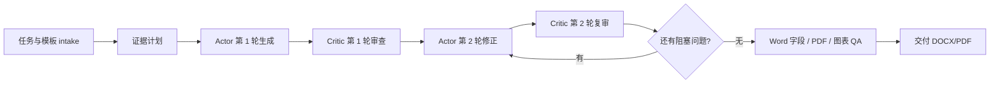

<p align="center">
  
</p>

<h1 align="center">DOCX Course Report Writer</h1>

<p align="center">
  面向中文课程报告、实验报告、课程论文与 LaTeX 转 Word 的 Codex Skill。
  <br>
  用“规划、证据、写作、审稿、验收”的工程化流程生成可提交的 DOCX/PDF 报告。
</p>

<p align="center">
  语言 / Language:
  <strong>简体中文</strong> |
  <a href="README.en.md">English</a>
</p>

<p align="center">
  <a href="#quick-start"></a>
  <a href="#quality-gates"></a>
  <a href="#superpowers-workflow"></a>
  <a href="#diagram-qa"></a>
  <a href="LICENSE"></a>
</p>

---

## 一句话

`docx-course-report-writer` 是一个本地 Codex Skill。它把课程报告从“临时写一篇文档”升级为“可规划、可验证、可修复、可复现交付”的工作流：先锁定任务和证据，再生成 DOCX，最后检查 Word 字段、目录、图表、排版和事实一致性。

它特别适合这些任务：

- 中文课程报告、实验报告、课程论文、读书报告、综述报告。
- 需要从代码运行结果、截图、图表、引用资料生成 Word 报告。
- 需要使用指定课程模板，或使用内置默认模板快速起稿。
- 需要把 LaTeX/TikZ、流程图、架构图、实验截图和数据图整合进 DOCX。
- 需要修复已有 DOCX 中的旧内容残留、目录错误、图文错位、字段未更新、PDF 导出问题。

## 目录

- [为什么使用它](#why)
- [核心能力](#features)
- [快速开始](#quick-start)
- [工作流](#workflow)
- [Superpowers 执行方式](#superpowers-workflow)
- [Actor/Critic 双智能体迭代](#actor-critic)
- [图像与流程图审查](#diagram-qa)
- [默认模板](#default-template)
- [质量门](#quality-gates)
- [项目结构](#project-structure)
- [示例与验证](#examples)
- [常见问题](#faq)

<a id="why"></a>

## 为什么使用它

普通“帮我写一份报告”的流程很容易出现四类问题：

| 常见问题 | 这个 Skill 的处理方式 |
| --- | --- |
| 内容看起来完整，但没有真实证据 | 建立需求到证据清单，真实运行代码、保留日志、截图和事实台账 |
| Word 看起来像排好了，但目录、页码、字段没有更新 | 优先使用 Word COM 更新字段、目录并导出 PDF |
| 模板里残留旧主题、旧截图、旧目录 | 强制执行模板残留检查，清理旧正文和无关媒体 |
| 流程图/TikZ 箭头交叉、文字压框、插图不好看 | 每张图必须进入 Review And Revise 阶段，重点审查箭头、布局、标签和缩放后的可读性 |

这个项目的目标不是只生成一份“能打开的 DOCX”，而是生成一份更接近真实提交标准的课程报告包。

<a id="features"></a>

## 核心能力

| 能力 | 说明 |
| --- | --- |
| 中文 DOCX 报告生成 | 支持课程报告、实验报告、课程论文、读书报告、综述等常见结构 |
| 模板优先 | 用户提供模板时使用用户模板；未提供时使用内置默认模板 |
| Word 字段与目录 | 使用真实标题样式和自动目录字段，Windows 下优先 Word COM 更新 |
| PDF 与页面级 QA | 需要时导出 PDF 或渲染页面，检查目录页、图表页、表格页、代码块页 |
| 证据优先写作 | 对实验结果、截图、数据、分数、文件名、模型名建立事实台账 |
| 图表与 TikZ 审查 | 流程图、架构图、机制图、时间线等必须完成最终审查与修正 |
| AI 图像受控插入 | 使用前必须询问是否开启文生图，以及最多生成几张，默认 3 张 |
| Actor/Critic 迭代 | 每次使用都创建 Actor 和 Critic，至少完成两轮迭代，缺陷未清零则继续 |

<a id="quick-start"></a>

## 快速开始

### 1. 安装到 Codex Skills

把本项目放入你的 Codex skills 目录，例如：

```powershell
C:\Users\<用户名>\.codex\skills\docx-course-report-writer
```

然后在 Codex 中直接点名使用：

```text
请使用 $docx-course-report-writer，根据 assignment.md 和 template.docx 生成课程报告。
```

### 2. 推荐输入

最稳妥的输入组合：

- 课程要求或评分标准。
- 用户指定的 DOCX 模板，如果没有则使用内置默认模板。
- 实验代码、运行日志、截图、数据表、参考文献或已有草稿。
- 姓名、学号、课程名、教师名、日期等封面信息。
- 是否需要 PDF、截图证明、图表、附录、引用格式。

### 3. 最小调用示例

```text
请使用 $docx-course-report-writer 写一份中文实验报告。
要求见 requirements.md，代码在 src/，需要真实运行并截图，最终输出 DOCX 和 PDF。
如需插入文生图，请先问我是否开启以及最多生成几张。
```

<a id="workflow"></a>

## 工作流



完整执行顺序见 [`references/workflow.md`](references/workflow.md)。

<a id="superpowers-workflow"></a>

## Superpowers 执行方式

如果环境中安装了 Superpowers 插件或 `superpowers:*` skills，本 Skill 必须优先调用相关 Superpowers 能力：

- 开始任务时检查并调用 Superpowers。
- 需要规划时使用计划流程。
- 需要开发、调试或修复时使用执行、调试或子智能体流程。
- 交付前使用 verification-before-completion 或等价的最终验证。

如果 Superpowers 不可用，则使用 [`references/superpowers-adapter.md`](references/superpowers-adapter.md) 中的本地降级流程，并在运行记录中说明限制。

<a id="actor-critic"></a>

## Actor/Critic 双智能体迭代

每次使用本 Skill 都必须创建两个角色：

| 角色 | 职责 |
| --- | --- |
| Actor | 负责收集材料、生成草稿、修复 DOCX、绘图、导出和再生成 |
| Critic | 负责独立审查实际产物，阻止未通过质量门的报告交付 |

强制规则：

- 至少完成两轮 `Actor -> Critic` 迭代。
- 迭代次数没有上限，Critic 仍发现阻塞问题时必须继续。
- Critic 审查的是当前 DOCX/PDF/图像/日志等真实产物，不只是计划。

协议细节见 [`references/actor-critic-loop.md`](references/actor-critic-loop.md)。

<a id="diagram-qa"></a>

## 图像与流程图审查

所有自绘图、TikZ 图、流程图、架构图、机制图、时间线和类似视觉材料，都必须在最终渲染后进入 `Review And Revise` 阶段。

重点检查：

- 箭头是否交叉、重叠、被遮挡、被裁剪或指向错误目标。
- 箭头是否压住文字、框体、图例、标题、编号或说明。
- 文字是否溢出、压框、过小、与边框或其他标签碰撞。
- 缩放进 DOCX/PDF 后是否仍清晰、美观、语义准确。
- AI 生成图不能替代真实实验结果、真实截图或真实数据图。

图像规则见 [`references/figures-and-diagrams.md`](references/figures-and-diagrams.md)。

<a id="default-template"></a>

## 默认模板

模板优先级固定：

1. 用户主动提供的 DOCX 模板。
2. 内置默认模板：[`skill-assets/default-course-report-template.docx`](skill-assets/default-course-report-template.docx)。

默认构建器会尽量保留模板的页面设置、标题样式、表格风格、封面风格和元数据，同时清理旧正文、旧截图、旧目录和无关媒体，避免模板残留污染新报告。

<a id="quality-gates"></a>

## 质量门

交付前必须通过或明确说明未通过原因：

- 证据真实性：实验结果、截图、数据、日志和引用不能凭空编造。
- 模板残留：不能残留旧主题、旧截图、旧目录、占位符或乱码。
- Word 字段：目录、页码、交叉引用和字段应更新。
- 事实一致性：分数、文件名、模型名、数据规模、日期和最终结论一致。
- 图像语义：每张自绘图或 TikZ 图都完成箭头、标签和排版审查。
- 渲染检查：必要时检查 PDF 或页面截图，而不只检查源文本。
- 分析深度：实验报告不能只有实现过程，还应包含结果分析、失败原因、局限和个人理解。

完整清单见 [`references/report-qa-checklist.md`](references/report-qa-checklist.md)。

<a id="project-structure"></a>

## 项目结构

```text
docx-course-report-writer/
├─ SKILL.md                         # Skill 入口与强制运行契约
├─ README.md                        # 中文默认说明
├─ README.en.md                     # English README
├─ assets/
│  └─ logo.png                      # README logo
├─ skill-assets/
│  ├─ default-course-report-template.docx
│  ├─ report-draft-template.md
│  ├─ references-template.md
│  └─ image-attributions-template.md
├─ references/
│  ├─ workflow.md
│  ├─ actor-critic-loop.md
│  ├─ figures-and-diagrams.md
│  ├─ report-qa-checklist.md
│  └─ ...
├─ scripts/
│  ├─ build_report.py
│  ├─ qa_docx_report.py
│  ├─ update_word_fields.ps1
│  └─ annotate_screenshot.py
└─ docs/
   ├─ sample-report.docx
   ├─ sample-report.pdf
   └─ testing-report.md
```

<a id="examples"></a>

## 示例与验证

- 示例报告 DOCX：[`docs/sample-report.docx`](docs/sample-report.docx)
- 示例报告 PDF：[`docs/sample-report.pdf`](docs/sample-report.pdf)
- 测试与验证记录：[`docs/testing-report.md`](docs/testing-report.md)
- 历史问题与修复经验：[`docs/historical-failures.md`](docs/historical-failures.md)

<a id="faq"></a>

## 常见问题

### 没有提供课程模板怎么办？

使用内置默认模板 [`skill-assets/default-course-report-template.docx`](skill-assets/default-course-report-template.docx)。如果用户提供模板，则用户模板优先。

### 可以自动生成插图吗？

可以，但必须先询问用户是否开启文生图，以及最多生成几张。默认上限是 3 张。AI 图像只能用于解释性或概念性配图，不能替代真实证据。

### 为什么必须至少两轮 Actor/Critic？

因为 DOCX 报告的常见失败不是“写不出来”，而是“写完后没有真正审查产物”。两轮迭代能强制把用户反馈中经常出现的问题前置到交付前。

### 为什么强调箭头检查？

流程图和 TikZ 图最常见的可读性问题是箭头交叉、箭头压字、箭头目标不清和缩放后重叠。这个 Skill 把箭头审查列为强制质量门。

## 设计参考

README 的首屏组织、语言入口和快速导航参考了 [`luongnv89/claude-howto`](https://github.com/luongnv89/claude-howto) 的项目说明风格；任务执行、规划、调试和验证思路参考了 [`obra/superpowers`](https://github.com/obra/superpowers) 的方法论。
