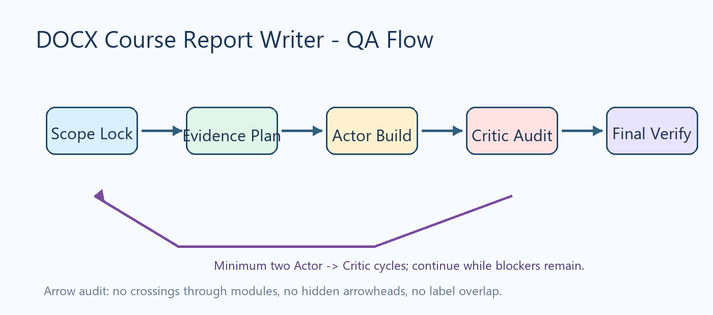

# DOCX 课程报告技能测试样例

## 1. 任务理解

本样例用于测试 `docx-course-report-writer` 的核心产物能力：真实 Word 标题样式、自动目录字段、表格、代码块、插图、图注来源、事实口径和无占位符检查。

## 2. 事实口径与证据

本次测试固定事实口径如下：最终有效分数为 99.69%，对照分数为 99.61%。本文不出现满分准确率口径，只保留“100 类”这类非准确率含义。

| 检查项 | 期望 | 证据 |
|---|---:|---|
| Heading 1 数量 | 1 个以上 | DOCX 样式检查 |
| 表格数量 | 1 个以上 | DOCX package 检查 |
| 图片数量 | 1 张以上 | inline shape 检查 |
| TOC 字段 | 存在 | document.xml 检查 |

## 3. 图像与流程


图片来源：本地测试脚本生成，非实验结果证据
图片宽度：11.8cm

图1 只用于测试插图流程。图中箭头经过 Review And Revise：起点、终点、方向和文字区域均不重叠。

## 4. 代码片段

```python
def final_score() -> float:
    return 99.69
```

## 5. 分析与反思

测试夹具覆盖了用户近期指出的核心风险：错误事实口径、图像箭头可读性、AI 图像文字审核、模板残留、目录字段和最终渲染验证。真实课程报告仍应使用实际任务书、运行日志、截图和源代码证据替换本样例数据。

{{REFERENCES}}
